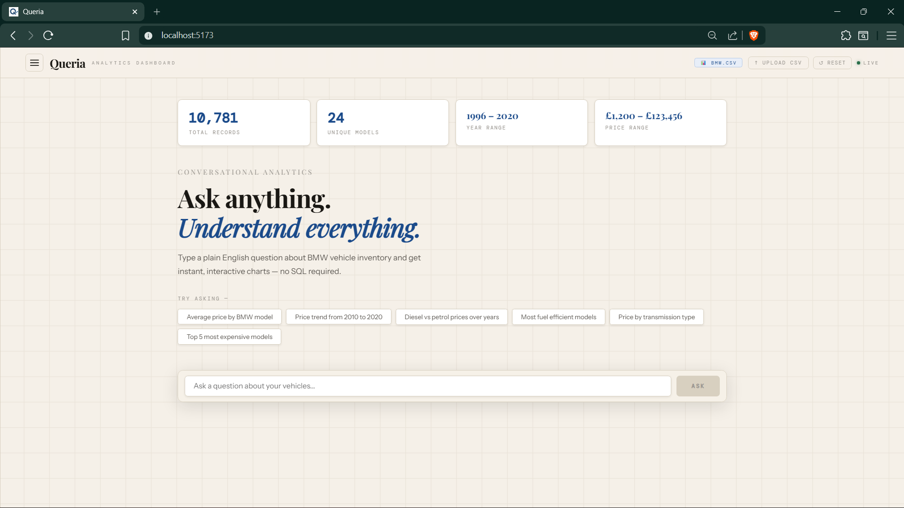
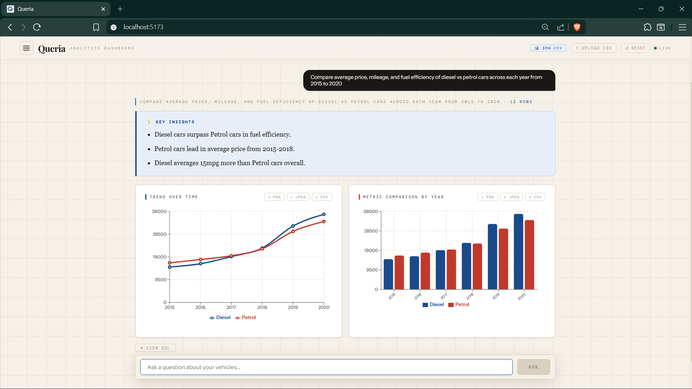
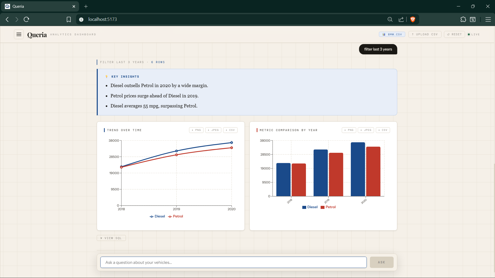

# Queria — Conversational BI Dashboard

> **Ask anything. Understand everything.**  
> Turn plain English into interactive data dashboards — instantly, no SQL required.

---

## What is Queria?

Queria is an AI-powered Business Intelligence tool that lets non-technical users query any dataset using natural language. Type a question, get back interactive charts, AI-generated insights, and downloadable data — all in seconds.

Built for the problem that every data team faces: business users wait days for simple dashboards while data engineers are buried in repetitive SQL requests. Queria eliminates that bottleneck entirely.

---

## Live Demo

> Run locally — see setup instructions below.  
> GitHub: [github.com/Akshar35/queria](https://github.com/Akshar35/queria)

## Screenshots





---

## Key Features

| Feature | Description |
|---|---|
| **Natural Language to SQL** | Ask questions in plain English — Queria generates and executes SQL automatically |
| **RAG-Enhanced Accuracy** | FAISS vector index + sentence embeddings retrieve similar query examples to improve SQL generation |
| **Multi-Chart Dashboards** | Each query generates 2–3 complementary charts (line, bar, pie, scatter) automatically |
| **AI Key Insights** | Executive-style bullet points summarizing the most important findings from every query |
| **Follow-up Questions** | Full conversation memory — ask "now filter this to diesel only" without repeating context |
| **CSV Upload** | Upload any CSV and immediately start querying it — fully dataset agnostic |
| **Smart Chart Selection** | Automatic chart type selection based on query semantics (time series → line, distribution → pie) |
| **Hallucination Guard** | Gracefully handles unanswerable queries instead of making up data |
| **Self-Healing SQL** | If SQL fails, automatically retries with error context |
| **Export** | Download any chart as PNG, JPEG, or raw CSV |

---

## Architecture

```
    User Query (Natural Language)
               │
               ▼
┌─────────────────────────────────────┐
│           RAG Pipeline              │
│  FAISS Index + Sentence Embeddings  │
│  Retrieves top-3 similar examples   │
│  Injects as few-shot context        │
└──────────────┬──────────────────────┘
               │
               ▼
┌─────────────────────────────────────┐
│         Gemini 2.5 Flash            │
│   Schema + RAG context + History    │
│   Generates validated SQLite SQL    │
└──────────────┬──────────────────────┘
               │
               ▼
┌─────────────────────────────────────┐
│           SQLite Database           │
│   Executes SQL → Returns results    │
│   Self-healing retry on failure     │
└──────────────┬──────────────────────┘
               │
               ▼
┌─────────────────────────────────────┐
│      Groq (LLaMA 3.3 70B)           │
│   Generates 3 executive insights    │
│   from query results                │
└──────────────┬──────────────────────┘
               │
               ▼
┌─────────────────────────────────────┐
│         React Frontend              │
│   Smart chart selection             │
│   Multi-chart dashboard render      │
│   Session history + follow-ups      │
└─────────────────────────────────────┘
```

---

## Tech Stack

**Frontend**
- React + Vite
- Recharts (interactive charts)
- Axios

**Backend**
- Python FastAPI
- SQLite (default BMW dataset + dynamic CSV upload)
- FAISS + sentence-transformers (RAG pipeline)

**AI / LLM**
- Google Gemini 2.5 Flash — SQL generation
- Groq LLaMA 3.3 70B — insight summarization

---

## Why RAG?

Most LLM-powered SQL tools prompt the model blindly and hope for the best. Queria uses **Retrieval-Augmented Generation** — a curated index of 20 high-quality (question → SQL) examples is embedded using `all-MiniLM-L6-v2`. At query time, the top-3 most semantically similar examples are retrieved and injected as few-shot demonstrations.

This dramatically improves SQL accuracy, especially for complex multi-table aggregations and time-series queries.

---

## Default Dataset

Queria ships with a BMW vehicle inventory dataset (10,781 records) covering:

| Column | Description |
|---|---|
| `model` | BMW model name (1–8 Series, X1–X7, M2–M6, i3, i8) |
| `year` | Registration year (1996–2020) |
| `price` | Listing price (£) |
| `transmission` | Automatic / Manual / Semi-Auto |
| `mileage` | Total miles driven |
| `fuelType` | Petrol / Diesel / Hybrid / Electric |
| `tax` | Annual road tax (£) |
| `mpg` | Miles per gallon |
| `engineSize` | Engine displacement (litres) |

---

## Setup & Installation

### Prerequisites
- Python 3.10+
- Node.js 18+
- Gemini API key ([aistudio.google.com](https://aistudio.google.com))
- Groq API key ([console.groq.com](https://console.groq.com))

### Backend

```bash
cd backend
python -m venv venv
venv\Scripts\activate       


pip install -r requirements.txt

Create `backend/.env`
GEMINI_API_KEY=your_gemini_key_here
GROQ_API_KEY=your_groq_key_here
```

Place your `bmw.csv` in `backend/data/` and run:
```bash
uvicorn main:app --reload
```

Backend runs at `http://localhost:8000`

### Frontend

`
cd frontend
npm install
npm run dev


Frontend runs at `http://localhost:5173`

---

## Example Queries

**Simple**
```
Average price by BMW model
```

**Time Series**
```
How have diesel vs petrol prices changed from 2015 to 2020?
```

**Complex**
```
Compare average price, mileage, and fuel efficiency of diesel vs petrol 
cars across each year from 2015 to 2020
```

**Follow-up**
```
Now show me the same but only for automatic transmission
```

**Hallucination test**
```
Show me customer satisfaction scores
```

---

## CSV Upload

Click **Upload CSV** in the header to load any dataset. Queria will:
1. Auto-detect the schema
2. Generate a dataset description
3. Suggest 6 relevant queries
4. Update all stats cards

Works with employee data, sales data, financial records — any tabular CSV.

---

## Project Structure

```
queria/
├── backend/
│   ├── main.py           # FastAPI app + endpoints
│   ├── llm.py            # Gemini SQL generation + Groq summaries
│   ├── rag.py            # FAISS vector index + retrieval
│   ├── database.py       # SQLite setup + query execution
│   ├── chart_selector.py # Smart chart type selection
│   └── requirements.txt
└── frontend/
    └── src/
        ├── App.jsx       # Main dashboard component
        └── index.css     # Editorial design system
```

---

## Evaluation Criteria Coverage

| Criteria | Implementation |
|---|---|
| **Data Retrieval Accuracy** | RAG pipeline + Gemini 2.5 Flash with schema injection |
| **Chart Selection** | Rule-based selector using SQL semantics |
| **Error Handling** | CANNOT_ANSWER guard + self-healing SQL retry |
| **Design** | Editorial warm off-white theme, Playfair Display typography |
| **Interactivity** | Hover tooltips, PNG/JPEG/CSV export per chart |
| **Follow-up Questions** | Full conversation history passed to LLM |
| **CSV Upload** | Dynamic schema detection + auto-generated suggestions |

---

## Built With

This project was built for the **Conversational AI for Instant Business Intelligence Dashboards** hackathon.
